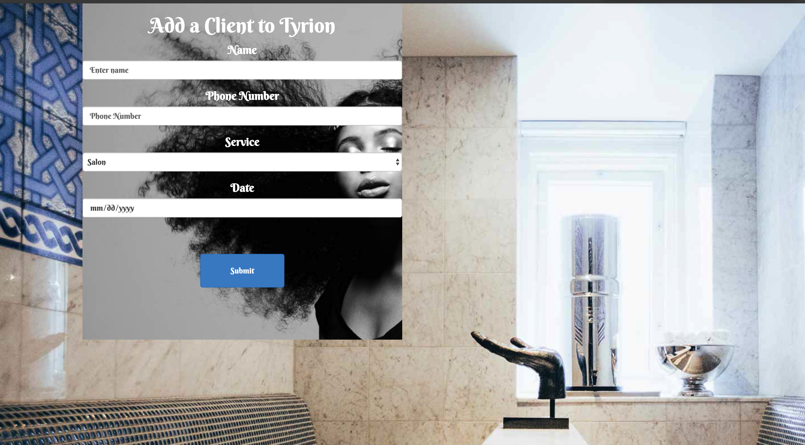
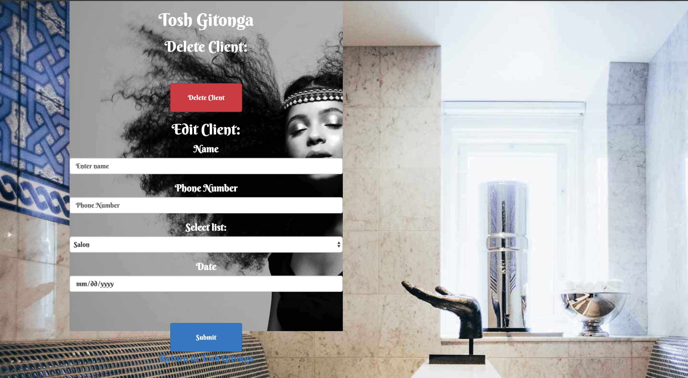

# Salon
This program allows the owners of a salon, to add stylists and there details to their system, add clients to specific 
 stylists and also edit the clients details or delete them completely

Version 1.0.0

# Contributors
Raymond Gitonga

## Description and Usage
This program uses spark forms,velocity template engine to allow users to create individual stylists specify
their details and add clients to them. The program utilises databases to store all the clients and stylist details.
The functionality of this program has been created using Java, with the creation of Individual 
classes to hold Stylist and Client attributes. 

### Here the website allows you to create an individual stylist set his/her details and add the to a stylist list

### Here the website allows you to add a client to the just created stylist set his/her details including the date of appointment

### Here the website allows you edit the clients details or even delete them completely

## BDD
|Behaviour   	|  Input  	|   Output	|   	
|---	|---	|---	|
|Create Stylist  	|Add stylist to your databse|Stylist created and added to list|   	
|Create Client	|Add client to specific stylist and set their details|Client created and added to individual stylist|  
|Edit Client details	|Edit client details or delete client entirely 	| Client details edited or entirely deleted | 

## Setup Installation Requirement
To access this project, you will need to access it from github then clone it.
Then run 'git clone https://github.com/raymondleta/Salon' on your terminal

## Technologies Used
1. Java
2. Spark Micro-framework
3. Velocity Template Engine
4. CSS

### Support or questions
For any questions feel free to contact me through gitongaraymondd@gmail.com

## License 
MIT 2019
Raymond Gitonga
